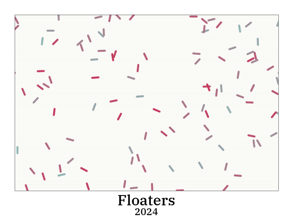

# Floaters
This is a simple sketch generating small line segments in blended colors along with a frame.
The font is IBM Plex Serif.

## Keys
r: Generate new color scheme
s: Save image as floaters.png
UP: Add floaters
DOWN: Remove floaters
LEFT: Decrease thickness
RIGHT: Increase thickness
