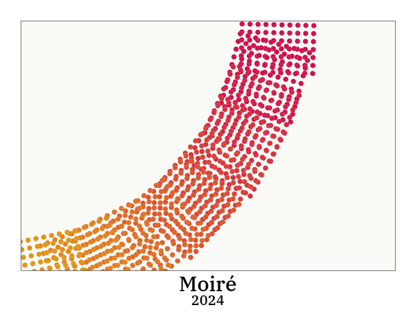
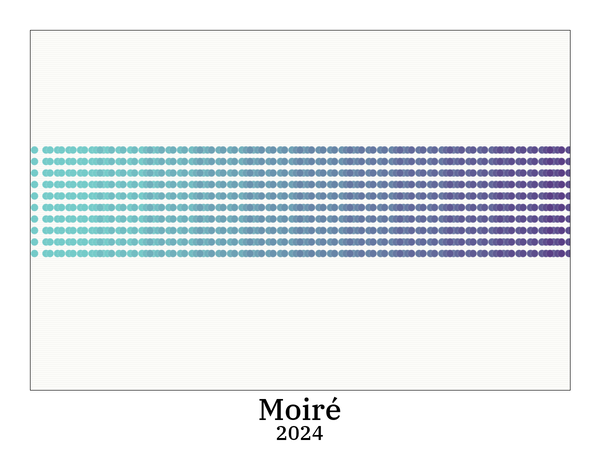

# Moire
Draws clusters of circles along an arc or a line, with varying rotation and offset to generate a moiré effect.

## Keys
r: Generate new color scheme
s: Save image as moire.png
UP: Add clusters
DOWN: Remove clusters
LEFT: Decrease radius
RIGHT: Increase radius
o: Increase randomness
l: Decrease randomness
m: Toggle mode arc<->line
