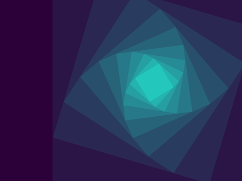

# EndlessRectangles
Draws rectangles within the rectangles drawn earlier... Math somehow doesn't add up so initial rotation not working.

## Controls
* Change position: Left, right, up and down
* Change amount of rectangles: a and d
* Change size of initial rectangle: w and s
* Toggle outline: o
* Save image: i
* Random colors: c
