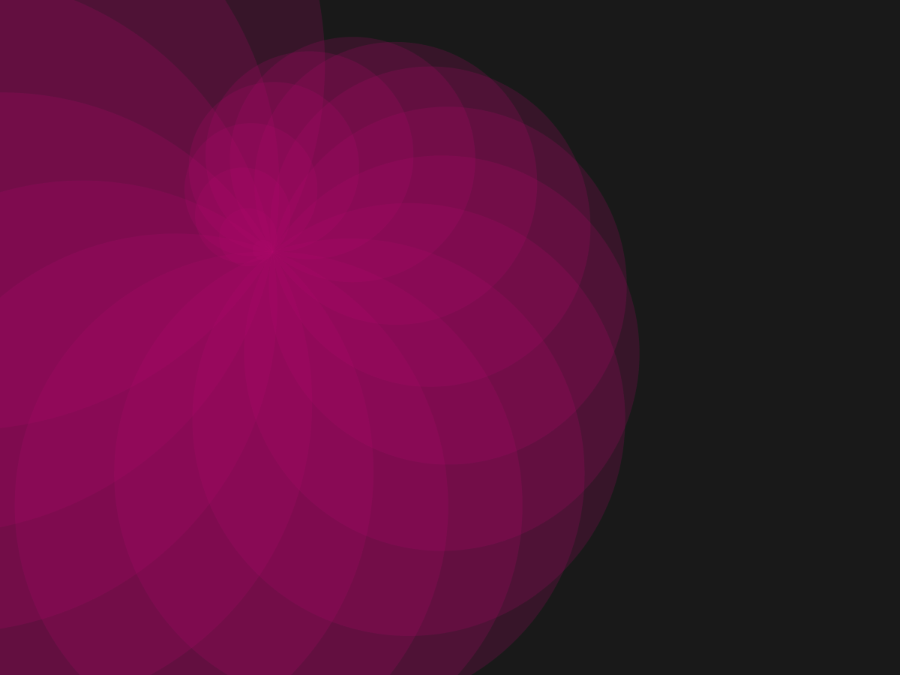

# Spirals
Uses alpha transparency of shapes to create seashell like structures in different colors.

## Controls
Increase or decrease starting size: w / s
Change overall rotation: a / d
Save image: i
Generate new color: c
Change initial rotation: , / .
Increase or deacrease iterations: + / - (numpad)
Set color to gray: b
Change mode to circle: 1
Change mode to squares: 2
Move up/down/left/right: UP/DOWN/LEFT/RIGHT
