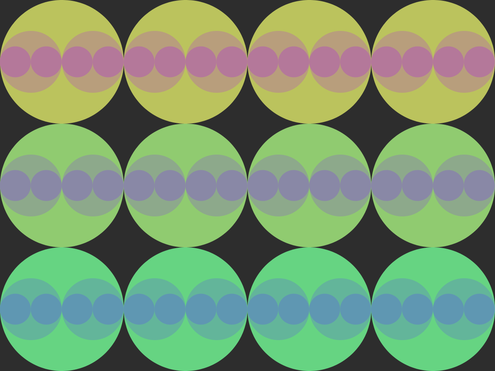

# SubCircles
Draws iterations of circles within each other, each iteration tinted differently.

## Controls
* Change amount of passes: Left and right
* Change amount of starting circles: Up and down
* Random colors: c
* Save image: i
* Reset: r
